# PROYECTO PARA CERTIFICACIÓN

Nombre: Cadena de Sumnistro V1.0

Objetivo: Inventario de seguimiento para tiendas

Requisitos:
1. Código en rust con estructura CRUD + PDA

2. Repositorio público en Git
   
3. Documentación: README y comentarios en el código
    

## Estructura CRUD----------------------------------------------------------------------------------------

## CREATE

Instruccion: Crear Tienda

    Permite la creacion de una PDA (Program Derived Adress), un tipo especial de cuenta en solana que permite prescindir 
    del uso de llaves privadas para la firma de transacciones. 

    Esta cuenta contendra el objeto (struct) de tipo Tienda donde podremos almacenar los Libros. 
    La creacion de la PDA depende de 3 cosas:
        * Wallet address 
        * Program ID 
        * string representativo, regularmente relacionado con el nombre del proyecto
    
    La explicacion de esto continua en el struct NuevaTienda

    Parametros de entrada:
        * nombre -> nombre de la tienda -> tipo string

Instruccion: Agregar Articulo

    Agrega un articulo al vector de articulos Contenido en el struct Tienda. 
    En este caso el contexto empleado es el struct NuevoArticulo. Mientras que NuevaTienda permite crear 
    Instancias de una Tienda. NuevoArticulo permite crear y modificar los valores relacionados a cualquier
    struct de tipo Articulo.

    Parametros de entrada:
        * nombre -> nombre del articulo -> string
        * cantidad -> numero de cantidad del articulo -> u16

## READ

Instruccion: Ver Libros

    Muestra en el log de la transaccion el contenido completo del vector de articulos de la Tienda

    Parametros de entrada:
        Ninguno

## UPDATE

Instruccion: cambiar Fecha
     
    Cambia la fecha registrada

    Parametros de entrada:
        * nombre -> Nombre del articulo -> string
     

Instruccion: cambiar Lugar
     
    Cambia el lugar registrado

    Parametros de entrada:
        * nombre -> Nombre del articulo -> string

Instruccion: cambiar cantidad
    
    Cambia la cantidad del articulo seleccionado

    Parametros de entrada:
        * nombre -> Nombre del articulo -> string

Instruccion: cambiar precio
    
    Cambia el precio del articulo seleccionado

    Parametros de entrada:
        * nombre -> Nombre del articulo -> string
    

Instruccion: Alternar Estado
     
    Cambia el estado de disponible de false a true o de true a false.

    Parametros de entrada:
        * nombre -> Nombre del articulo -> string
    

## DELETE

    Instruccion: Eliminar Articulo
    /*
    Elimina un articulo apartir de su nombre. Error si articulo no existe, Error si vector vacio. 

    Parametros de entrada:
        * nombre -> Nombre del articulo -> string
     */

# STRUCT

-Especifica que el struct es una cuenta que se almacenara en la blockchain
[account]
Struct interno o secundario (No es una cuenta). Se define por derive y cuenta con los siguientes atributos:
[derive(AnchorSerialize, AnchorDeserialize, Clone, InitSpace, PartialEq, Debug)]

    * AnchorSerialize -> Permite guardar el struct en la cuenta 
    * AnchorDeserialize -> Permite leer su contenido desde la cuenta 
    * Clone -> Para copiar su contenido o valores 
    * InitSpace -> Calcula el tamaño necesario para ser almacenado en la blockchain
    * PartialEq -> Para usar sus valores y compararlos con "=="
    * Debug -> Para mostrarlo en log con ":?" o ":#?"

# CONTEXT

-Creacion de los contextos para las instrucciones (funciones)
[derive(Accounts)] // Especifica que este struct describe las cuentas que se requieren para determinada instruccion

---------------Estructura PDA-----------------------------------------------------------------------------------------

    #[account(
        init, // Indica que al llamar la instruccuion se creara una cuenta
        // puede ser remplazado por "init_if_needed" para que solo se cree una vez por caller
        payer = owner, // Se especifica que quien paga el llamado a la instruccion, en este caso llama la instruccion 
        space = Tienda::INIT_SPACE + 8, // Se calcula el espacio requerido para almacenar el Solana Program On-Chain
        seeds = [b"tienda", owner.key().as_ref()], // Se especifica que la cuenta es una PDA que depende de un string y el id del owner

----------------------------------------------------------------------------------------------------------------------

-Contexto para la creacion y modificacion de articulos 
Especifica que este struct se requiere para todas las instrucciones relacionadas con la creacion o modificacion de Articulo
[derive(Accounts)]

----------------------
TOTAL gastado: 7.267606 SOL
----------------------

# RESULTADO

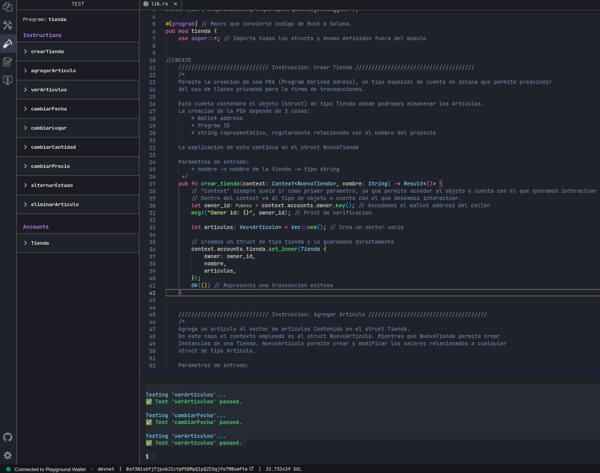

## Instrucción: crear Tienda

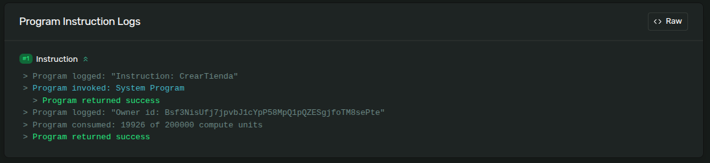

## Instruccion: agregar Articulo

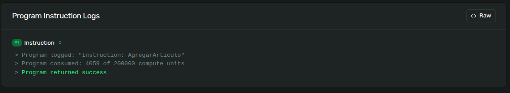

## Instruccion: ver Articulos

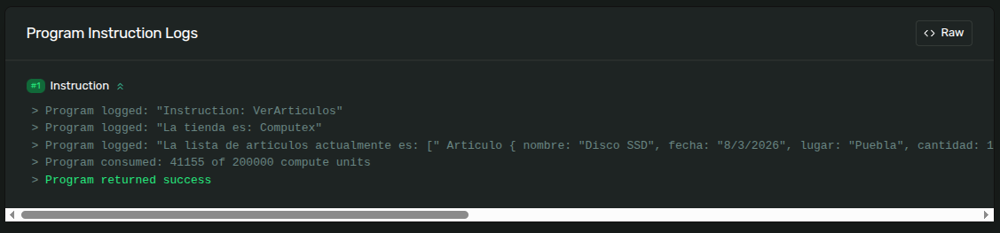
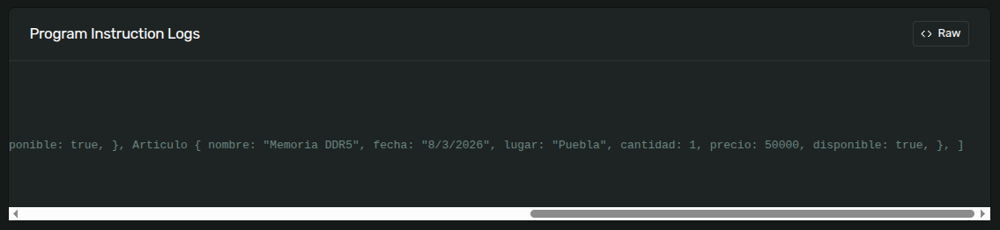

## Instruccion: cambiar Fecha

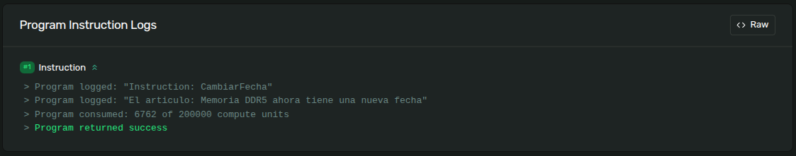
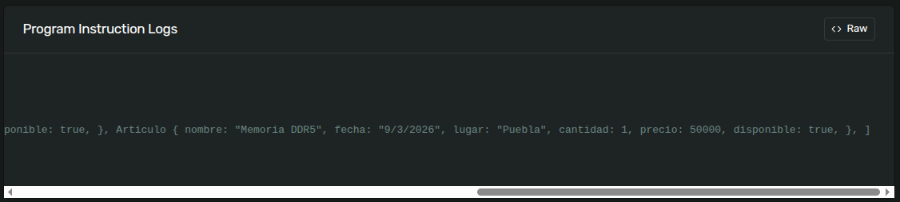

## Instruccion: cambiar Lugar

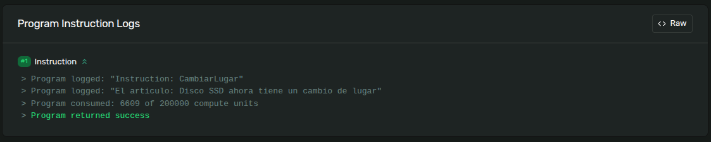
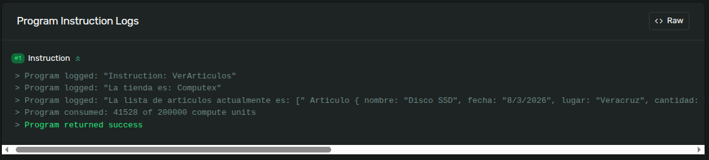
 
## Instruccion: cambiar cantidad

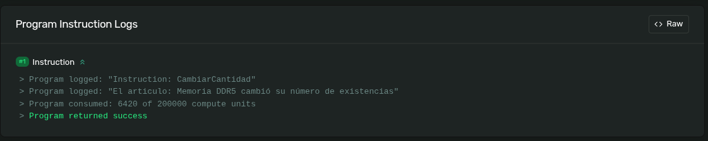
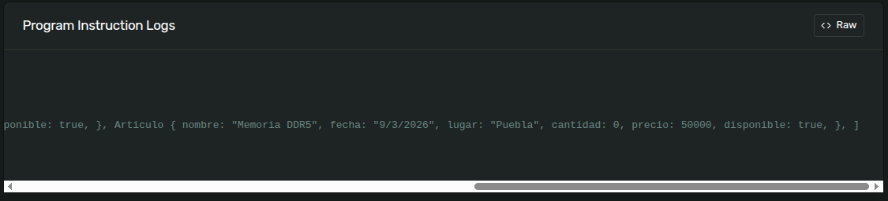

## Instruccion: cambiar precio
    
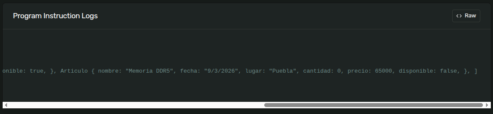

## Instruccion: eliminar Articulo

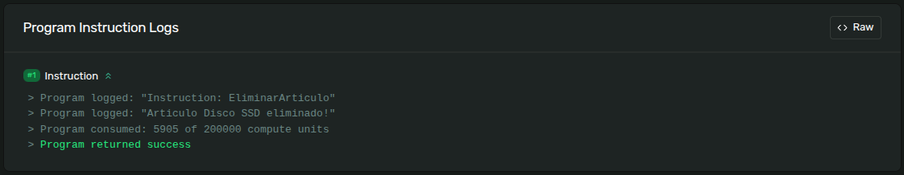
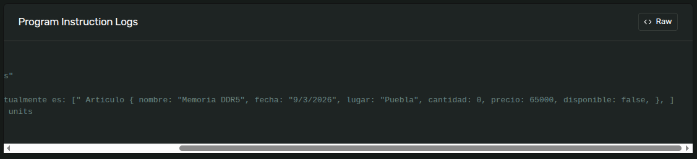
